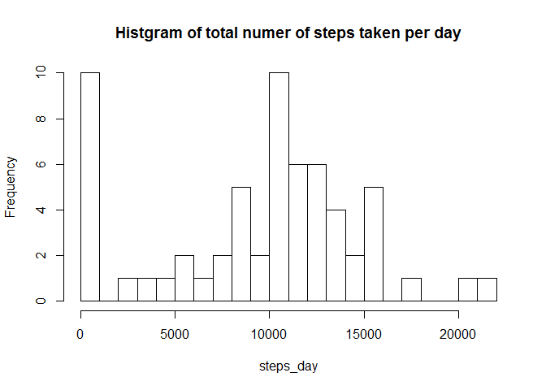
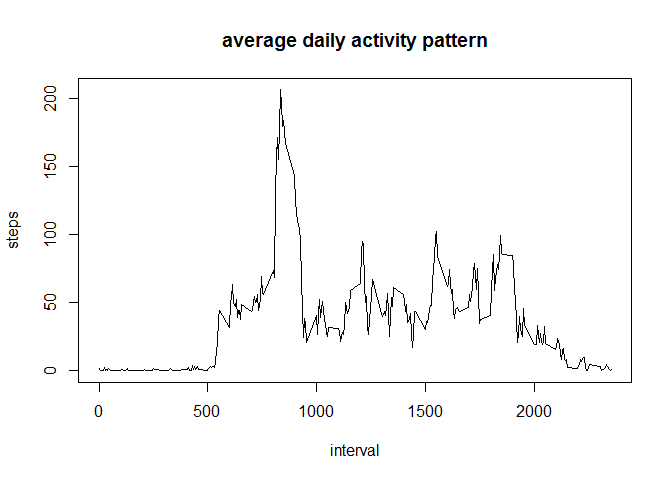
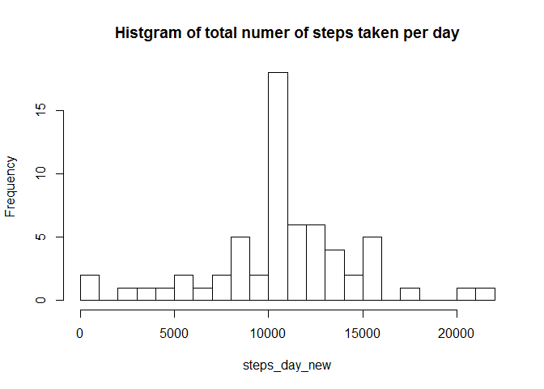
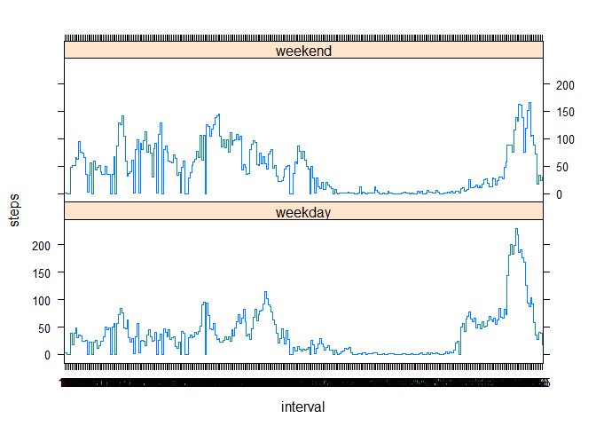

# Reproducible Research: Peer Assessment 1


## Loading and preprocessing the data

```r
library(lattice);
dat <- read.csv("activity.csv");
```


## What is mean total number of steps taken per day?

```r
steps_day <- tapply(dat$steps, dat$date, sum, na.rm = T);
hist(steps_day, breaks = 20, main = "Histgram of total numer of steps taken per day");
```

 

Calculate and report mean and median of the total number of steps

```r
rep <- summary(steps_day);
rep[c("Mean", "Median")]
```

```
##   Mean Median 
##   9354  10400
```

## What is the average daily activity pattern?

```r
steps_interval <- tapply(dat$steps, dat$interval, mean, na.rm = T);
x <- dimnames(steps_interval);
x <- x[[1]];
plot(x, steps_interval, main = "average daily activity pattern", type = 'l', xlab = "interval", ylab = "steps");
```

 


Which 5-minute interval, on average across all the days in the dataset, contains the maximum number of steps?

```r
steps_interval[steps_interval==max(steps_interval)]
```

```
##      835 
## 206.1698
```


## Imputing missing values
1. Calculate and report the total number of missing values in the dataset (i.e. the total number of rows with NAs)

```r
sum(is.na(dat$steps))
```

```
## [1] 2304
```


2. Devise a strategy for filling in all of the missing values in the dataset. The strategy does not need to be sophisticated. For example, you could use the mean/median for that day, or the mean for that 5-minute interval, etc.
3. Create a new dataset that is equal to the original dataset but with the missing data filled in.

```r
dat_new <- dat;
for (i in 1:17568){
    if(is.na(dat[i, 1]))
        dat_new[i, 1] = steps_interval[toString(dat[i, 3])];
}
```

4. Make a histogram of the total number of steps taken each day and Calculate and report the mean and median total number of steps taken per day. 

```r
steps_day_new <- tapply(dat_new$steps, dat_new$date, sum, na.rm = T);
hist(steps_day_new, breaks = 20, main = "Histgram of total numer of steps taken per day");
```

 

```r
rep <- summary(steps_day_new);
rep[c("Mean", "Median")]
```

```
##   Mean Median 
##  10770  10770
```

Do these values differ from the estimates from the first part of the assignment?

[Ans] Yes.

What is the impact of imputing missing data on the estimates of the total daily number of steps?

[Ans] It decreases the estimatation.


## Are there differences in activity patterns between weekdays and weekends?
1. Create a new factor variable in the dataset with two levels – “weekday” and “weekend” indicating whether a given date is a weekday or weekend day.


```r
Sys.setlocale("LC_TIME", "English");
```

```
## [1] "English_United States.1252"
```

```r
var1<- dimnames(steps_day_new);
var1<- var1[[1]];
dic <- data.frame("date" = var1);
var1<-strptime(var1, "%Y-%m-%d");
var1 <- weekdays(var1);
for(i in 1:61)
    dic[i, "weekday"] = ifelse(var1[i] %in% c("Sunday", "Saturday"), F, T);
```

2. Make a panel plot containing a time series plot (i.e. type = "l") of the 5-minute interval (x-axis) and the average number of steps taken, averaged across all weekday days or weekend days (y-axis). See the README file in the GitHub repository to see an example of what this plot should look like using simulated data.

```r
dat_new <- merge(dat_new, dic, by = "date");
dat_new <- split(dat_new, dat_new$weekday);
steps_interval_new_T <- tapply(dat_new[[2]]$steps, dat_new[[2]]$interval, mean, na.rm = T);
steps_interval_new_F <- tapply(dat_new[[1]]$steps, dat_new[[1]]$interval, mean, na.rm = T);
y <- data.frame("interval" = c(x, x),"steps" = c(steps_interval_new_T, steps_interval_new_F), "weekday" = c(rep("weekday", 288), rep("weekend", 288)));
xyplot(steps~interval|weekday, data = y, layout = c(1, 2), type = 's');
```

 
